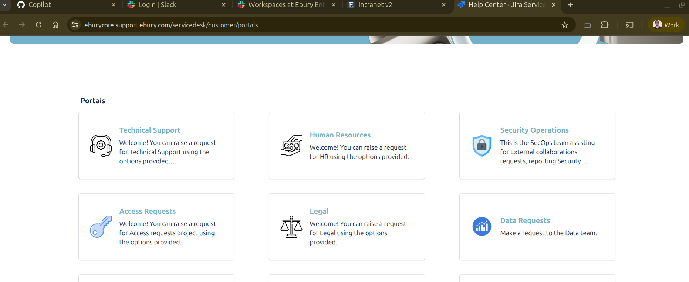
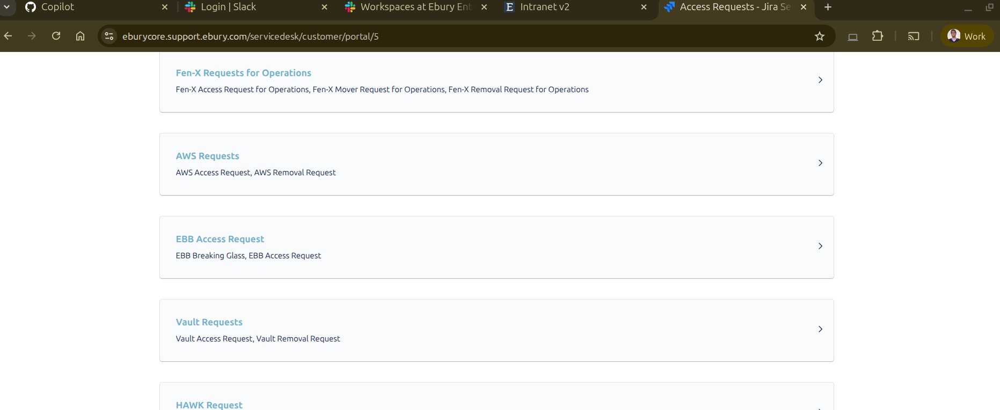
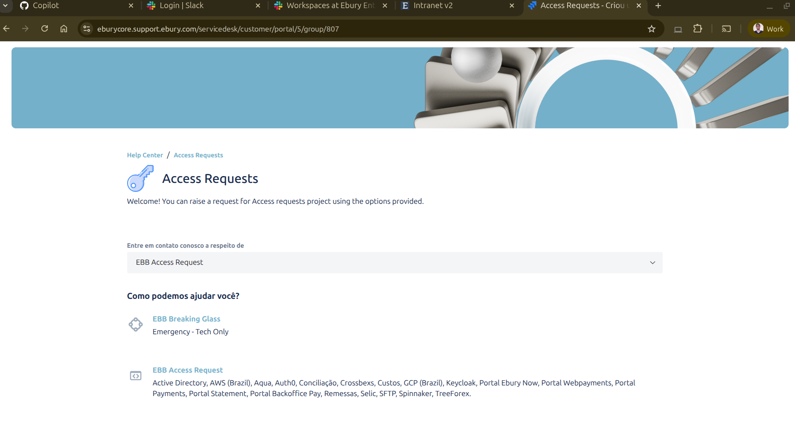
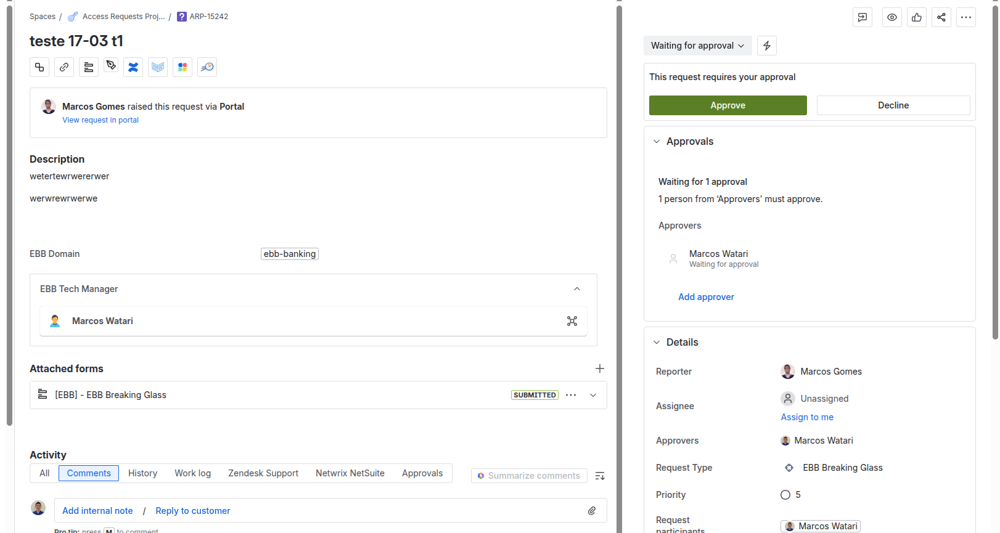
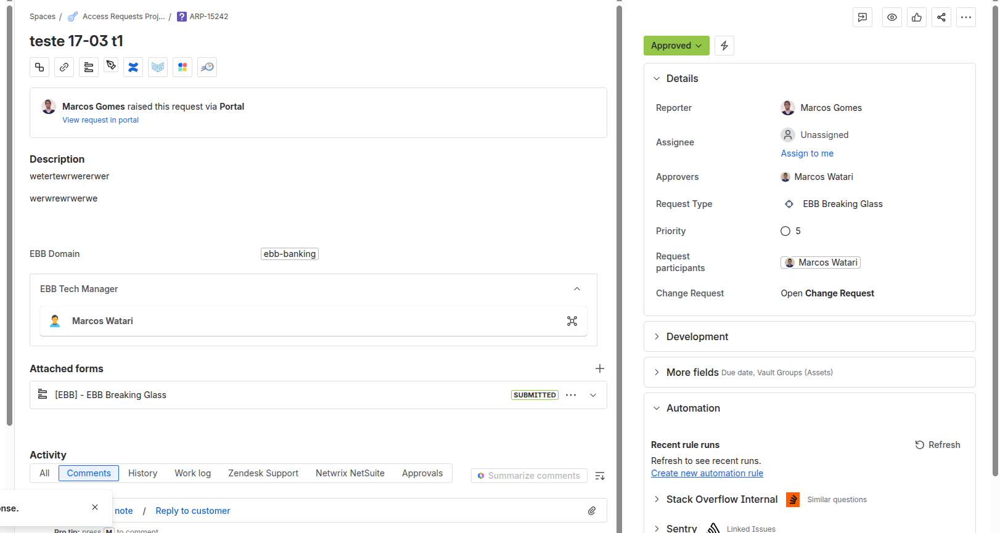

# Breaking Glass — Acesso Emergencial de Produção

## Índice

- [Visão Geral](#visão-geral)
- [Quando Utilizar](#quando-utilizar)
- [Pré-requisitos](#pré-requisitos)
- [Fluxo Completo](#fluxo-completo)
  - [1. Solicitação de Acesso (Manual)](#1-solicitação-de-acesso-manual)
  - [2. Aplicação Automática (Terraform Apply)](#2-aplicação-automática-terraform-apply)
  - [3. Expiração e Limpeza (Automática)](#3-expiração-e-limpeza-automática)
- [Domínios Disponíveis](#domínios-disponíveis)
- [Notificações por E-mail](#notificações-por-e-mail)
- [Arquitetura Técnica](#arquitetura-técnica)
- [FAQ](#faq)

---

## Visão Geral

O **Breaking Glass** é um processo automatizado de acesso emergencial a ambientes de **produção** no GCP. Ele permite conceder permissões temporárias e com expiração automática através de um workflow do GitHub Actions, garantindo:

- **Acesso temporário**: permissões expiram automaticamente após 8 horas
- **Auditabilidade completa**: todas as concessões são rastreadas via commits no repositório `ebb-iac-iam`
- **Princípio do menor privilégio**: as permissões concedidas são limitadas a uma custom role específica (`ebb_breaking_glass_iam_role`)
- **Limpeza automática**: um job diário remove entradas expiradas

---

## Quando Utilizar

- Incidentes em produção que necessitam de acesso direto a recursos GCP
- Debugging emergencial de aplicações em ambiente produtivo
- Situações onde o acesso normal via grupos do Google Workspace não é suficiente

> **Importante**: Este processo é exclusivo para cenários de emergência. Para acessos recorrentes, utilize o fluxo padrão de IAM via PR no repositório `ebb-iac-iam`.

---

## Pré-requisitos

1. Acesso ao repositório [ebb-iac-iam](https://github.com/Ebury-Brazil/ebb-iac-iam) no GitHub
2. Permissão para disparar workflows (`workflow_dispatch`)
3. ID de uma issue Jira relacionada ao incidente
4. E-mail corporativo `@ebury.com` do usuário que precisa do acesso

---

## Fluxo Completo

### 1. Solicitação de Acesso (Manual)

Acesse o repositório `ebb-iac-iam` no GitHub e navegue até **Actions** > **ebb-terraform-breaking-glass-pipeline**.



Clique em **"Run workflow"** e preencha os campos:

| Campo | Descrição | Exemplo |
|-------|-----------|---------|
| `FIRST_LEVEL_DIRECTORIES_JSON` | Domínio/projeto GCP (selecione um da lista) | `["ebb-banking"]` |
| `ENVIRONMENTS_JSON` | Ambiente (sempre `["production"]`) | `["production"]` |
| `BREAKING_ROLE` | Role IAM (não alterar) | `roles/ebb_breaking_glass_iam_role` |
| `BREAKING_MEMBER` | E-mail do usuário no formato `user:email` | `user:marcos.gomes@ebury.com` |
| `BREAKING_TITLE` | Título da condição | `Emergency Access` |
| `BREAKING_DESCRIPTION` | Descrição da condição | `Temporary escalation` |
| `BREAKING_EXPIRATION_HOURS` | Horas até expiração (fixo em 8h) | `8` |
| `ISSUE_ID` | Número da issue Jira | `EPT-1234` |
| `BREAKING_APPROVER` | Aprovadores (separados por vírgula) | `Marcos Gomes,John Doe` |



Após disparar o workflow, o script `add_iam_role_conditions.py` realiza as seguintes ações:

1. Faz checkout da branch `main`
2. Edita o arquivo `production.tfvars` do domínio selecionado
3. Adiciona uma entrada no array `breaking_glass` com condição temporal
4. Faz commit e push direto na `main`



A entrada adicionada no `.tfvars` tem o seguinte formato:

```hcl
breaking_glass = [
  {
    project = "ebb-banking-prod"
    role    = "projects/ebb-banking-prod/roles/ebb_breaking_glass_iam_role"
    member  = "user:marcos.gomes@ebury.com"
    condition = {
      title       = "Emergency Access"
      description = "Temporary escalation"
      expression  = "request.time < timestamp(\"2026-03-17T22:38:11.075972+00:00\")"
    }
  }
]
```

### 2. Aplicação Automática (Terraform Apply)

Ao concluir com sucesso, o workflow `ebb-terraform-apply-trigger` é acionado automaticamente:

1. Detecta que o workflow de breaking glass foi concluído com sucesso
2. Executa `terraform apply` no ambiente de produção
3. As permissões IAM são aplicadas no projeto GCP correspondente
4. Um e-mail de confirmação é enviado ao solicitante


### 3. Expiração e Limpeza (Automática)

Um job agendado (`cleanup_iam_conditions.py`) roda diariamente às **08:00 GMT-3** e:

1. Lê os arquivos `.tfvars` de todos os domínios e ambientes
2. Verifica o timestamp de expiração de cada entrada em `breaking_glass`
3. Remove as entradas expiradas
4. Faz commit e push automático na `main`
5. O Terraform Apply subsequente remove as permissões do GCP



> As permissões temporárias são controladas por IAM Conditions do GCP. Mesmo antes da limpeza automática no `.tfvars`, o próprio GCP já nega o acesso após o timestamp de expiração.

---

## Domínios Disponíveis

| Domínio | Projeto GCP (Produção) |
|---------|----------------------|
| `ebb-platform` | `ebb-platform-prod` |
| `ebb-shared-services` | `ebb-shared-services-prod` |
| `ebb-banking` | `ebb-banking-prod` |
| `ebb-ebury-connect` | `ebb-ebury-connect-prod` |
| `ebb-ebury-connect-pci` | `ebb-ebury-connect-pci-prod` |
| `ebb-fx-engine` | `ebb-fx-engine-prod` |
| `ebb-client-journey` | `ebb-client-journey-prod` |
| `ebb-bigdata` | `ebb-bigdata-prod` |
| `ebb-money-flows` | `ebb-money-flows-prod` |
| `ebb-network-infra` | `ebb-network-infra-prod` |

---

## Notificações por E-mail

Após a execução do Terraform Apply, o sistema envia um e-mail (via SendGrid) com o resultado:

- **Sucesso** (`✅ Breaking Glass Access Granted`): contém detalhes do acesso concedido, incluindo projeto, usuário, aprovador e horário de expiração
- **Falha** (`❌ Breaking Glass Request Failed`): informa que o acesso **não** foi concedido e inclui o output do Terraform para diagnóstico



---

## Arquitetura Técnica

```
┌─────────────────────────────────────────────────────────┐
│                    GitHub Actions                        │
│                                                          │
│  ┌──────────────────────┐    ┌────────────────────────┐  │
│  │  workflow_dispatch    │    │  workflow_run trigger   │  │
│  │  (manual)             │───▶│  (automático)          │  │
│  │                       │    │                        │  │
│  │  breaking-glass.yaml  │    │  apply-breaking-glass  │  │
│  └──────────┬───────────┘    └───────────┬────────────┘  │
│             │                            │               │
│             ▼                            ▼               │
│  ┌──────────────────────┐    ┌────────────────────────┐  │
│  │ add_iam_role_         │    │ terraform apply        │  │
│  │ conditions.py         │    │ (production)           │  │
│  │                       │    │                        │  │
│  │ • Edita .tfvars       │    │ • Aplica IAM bindings  │  │
│  │ • Commit direto main  │    │ • Envia e-mail         │  │
│  └──────────────────────┘    └────────────────────────┘  │
│                                                          │
│  ┌──────────────────────┐                                │
│  │ cleanup_iam_          │  ← Cron diário 08:00 GMT-3    │
│  │ conditions.py         │                                │
│  │                       │                                │
│  │ • Remove expirados    │                                │
│  │ • Commit direto main  │                                │
│  └──────────────────────┘                                │
└─────────────────────────────────────────────────────────┘
```

### Repositórios Envolvidos

| Repositório | Função |
|-------------|--------|
| `ebb-iac-iam` | Contém os `.tfvars` com IAM roles e o workflow de breaking glass |
| `ebb-terraform-cicd-workflows` | Templates reutilizáveis de pipelines (breaking glass, apply, cleanup) |
| `ebb-terraform-gcp-iam` | Módulo Terraform que processa a variável `breaking_glass` |

---

## FAQ

**P: Posso solicitar acesso para mais de um domínio ao mesmo tempo?**
R: Não. Cada disparo do workflow atende a um único domínio (`FIRST_LEVEL_DIRECTORIES_JSON`). Para múltiplos domínios, dispare o workflow separadamente para cada um.

**P: Posso alterar o tempo de expiração para mais de 8 horas?**
R: O campo aceita outros valores, mas a pipeline está configurada para forçar 8 horas independentemente do valor informado.

**P: O que acontece se a pipeline de apply falhar?**
R: O acesso **não** é concedido. Um e-mail de falha é enviado e o time de plataforma deve ser acionado para investigar.

**P: Preciso criar uma issue Jira antes?**
R: Sim. O campo `ISSUE_ID` é obrigatório para rastreabilidade do acesso emergencial.

**P: As permissões param de funcionar exatamente após 8 horas?**
R: Sim. O GCP avalia a IAM Condition em tempo real. Mesmo antes da limpeza automática no `.tfvars`, o acesso é negado após o timestamp de expiração.