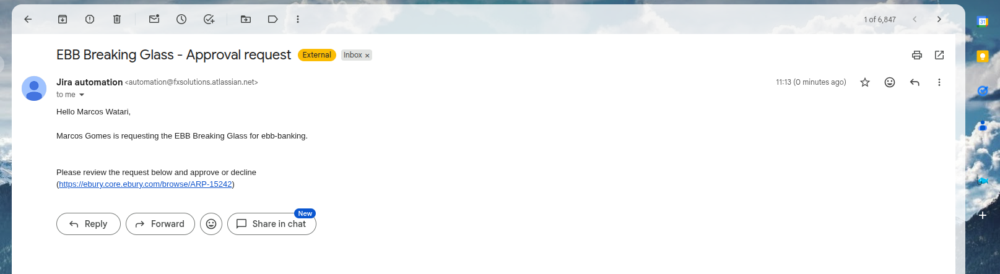
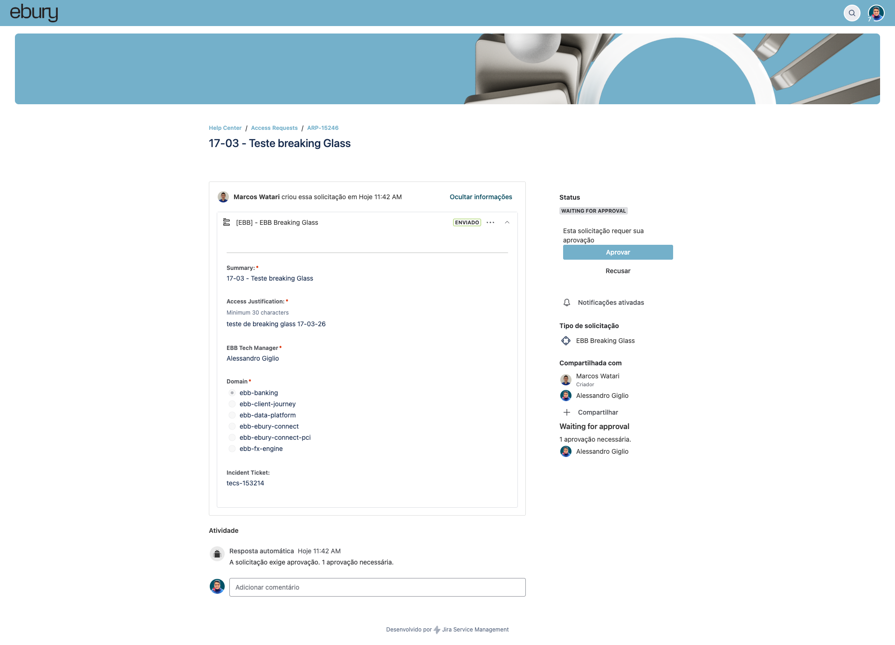
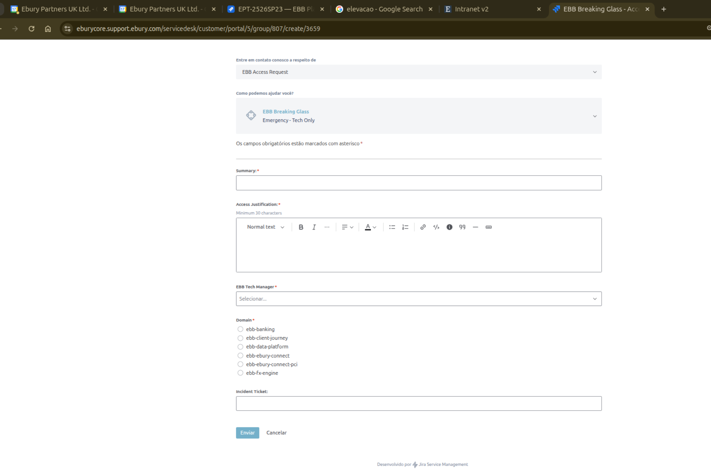
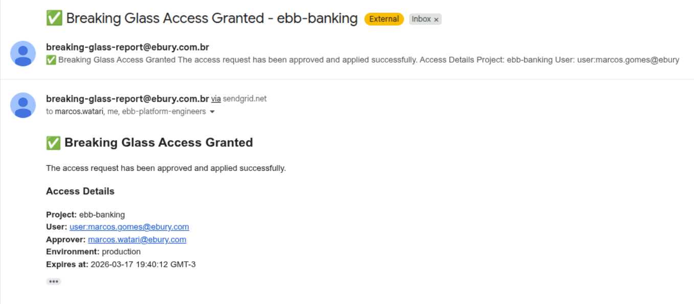

# Breaking Glass — Acesso Emergencial de Produção

## Índice

- [Visão Geral](#visão-geral)
- [Quando Utilizar](#quando-utilizar)
- [Pré-requisitos](#pré-requisitos)
- [Fluxo Completo](#fluxo-completo)
  - [1. Solicitação de Acesso (Manual)](#1-solicitação-de-acesso-manual)
  - [2. Aplicação Automática (Terraform Apply)](#2-aplicação-automática-terraform-apply)
  - [3. Expiração e Limpeza (Automática)](#3-expiração-e-limpeza-automática)
- [Domínios Disponíveis](#domínios-disponíveis)
- [Notificações por E-mail](#notificações-por-e-mail)
- [Arquitetura Técnica](#arquitetura-técnica)
- [FAQ](#faq)

---

## Visão Geral

O **Breaking Glass** é um processo automatizado de acesso emergencial a ambientes de **produção** no GCP. Ele permite conceder permissões temporárias e com expiração automática através de um workflow do GitHub Actions, garantindo:

- **Acesso temporário**: permissões expiram automaticamente após 8 horas
- **Auditabilidade completa**: todas as concessões são rastreadas via commits no repositório `ebb-iac-iam`
- **Princípio do menor privilégio**: as permissões concedidas são limitadas a uma custom role específica (`ebb_breaking_glass_iam_role`)
- **Limpeza automática**: um job diário remove entradas expiradas

---

## Quando Utilizar

- Incidentes em produção que necessitam de acesso direto a recursos GCP
- Debugging emergencial de aplicações em ambiente produtivo

> **Importante**: Este processo é exclusivo para cenários de emergência. Para acessos recorrentes, registre um ticket para o time de EBB Plataforma solicitando a elevação dos acessos.

---

## Pré-requisitos

1. Criar um ticket Jira no board: https://eburycore.support.ebury.com/servicedesk/customer/portal/5/group/807
2. E-mail corporativo `@ebury.com` do usuário que precisa do acesso

---

## Fluxo Completo

### 1. Solicitação de Acesso (Manual)

Acesse o board do Jira e crie o ticket em **Access Requests**.


Acesse **EBB Access Request**.


Acesse **EBB Breaking Glass**.


Crie o ticket. Você receberá uma notificação via e-mail:


O acesso é concedido à pessoa que está criando a issue no Jira. Informe o nome do seu gerente também.


Peça para o seu gerente aprovar:


Após o acesso ser concedido, você receberá uma mensagem de confirmação via e-mail, que é enviada para o Solicitante, o Aprovador e o Time de Plataforma.


### 2. Informações Gerais

1. Caso receba algum e-mail de falha, entre em contato com o time de plataforma.
2. A role de Breaking Glass no ambiente de produção é um clone da role de dev que o seu time possui. Caso precise fazer algo que a sua role convencional em dev não faça, isso também não estará funcionando em produção.
3. As roles têm uma validade de 8 horas após o e-mail de confirmação ser enviado.
4. Há uma automação que roda de 4 em 4 horas, verificando se há permissões expiradas e fazendo a remoção das permissões com acessos privilegiados.
---

## Domínios Disponíveis

| Domínio | Projeto GCP (Produção) |
|---------|----------------------|
| `ebb-shared-services` | `ebb-shared-services-prod` |
| `ebb-money-flows` | `ebb-money-flows-prod` |
| `ebb-ebury-connect` | `ebb-ebury-connect-prod` |
| `ebb-ebury-connect-pci` | `ebb-ebury-connect-pci-prod` |
| `ebb-fx-engine` | `ebb-fx-engine-prod` |
| `ebb-client-journey` | `ebb-client-journey-prod` |
| `ebb-bigdata` | `ebb-bigdata-prod` |

---

## Arquitetura Técnica

```
┌─────────────────────────────────────────────────────────┐
│                    GitHub Actions                        │
│                                                          │
│  ┌──────────────────────┐    ┌────────────────────────┐  │
│  │  workflow_dispatch    │    │  workflow_run trigger   │  │
│  │  (manual)             │───▶│  (automático)          │  │
│  │                       │    │                        │  │
│  │  breaking-glass.yaml  │    │  apply-breaking-glass  │  │
│  └──────────┬───────────┘    └───────────┬────────────┘  │
│             │                            │               │
│             ▼                            ▼               │
│  ┌──────────────────────┐    ┌────────────────────────┐  │
│  │ add_iam_role_         │    │ terraform apply        │  │
│  │ conditions.py         │    │ (production)           │  │
│  │                       │    │                        │  │
│  │ • Edita .tfvars       │    │ • Aplica IAM bindings  │  │
│  │ • Commit direto main  │    │ • Envia e-mail         │  │
│  └──────────────────────┘    └────────────────────────┘  │
│                                                          │
│  ┌──────────────────────┐                                │
│  │ cleanup_iam_          │  ← Cron diário 08:00 GMT-3    │
│  │ conditions.py         │                                │
│  │                       │                                │
│  │ • Remove expirados    │                                │
│  │ • Commit direto main  │                                │
│  └──────────────────────┘                                │
└─────────────────────────────────────────────────────────┘
```

---

## FAQ

**P: Posso solicitar acesso para mais de um domínio ao mesmo tempo?**
R: Não. Cada disparo do workflow atende a um único domínio (`FIRST_LEVEL_DIRECTORIES_JSON`). Para múltiplos domínios, dispare o workflow separadamente para cada um.

**P: Posso alterar o tempo de expiração para mais de 8 horas?**
R: O campo aceita outros valores, mas a pipeline está configurada para forçar 8 horas independentemente do valor informado.

**P: O que acontece se a pipeline de apply falhar?**
R: O acesso **não** é concedido. Um e-mail de falha é enviado e o time de plataforma deve ser acionado para investigar.

**P: Preciso criar uma issue Jira antes?**
R: Sim. O campo `ISSUE_ID` é obrigatório para rastreabilidade do acesso emergencial.

**P: As permissões param de funcionar exatamente após 8 horas?**
R: Sim. O GCP avalia a IAM Condition em tempo real. Mesmo antes da limpeza automática no `.tfvars`, o acesso é negado após o timestamp de expiração.